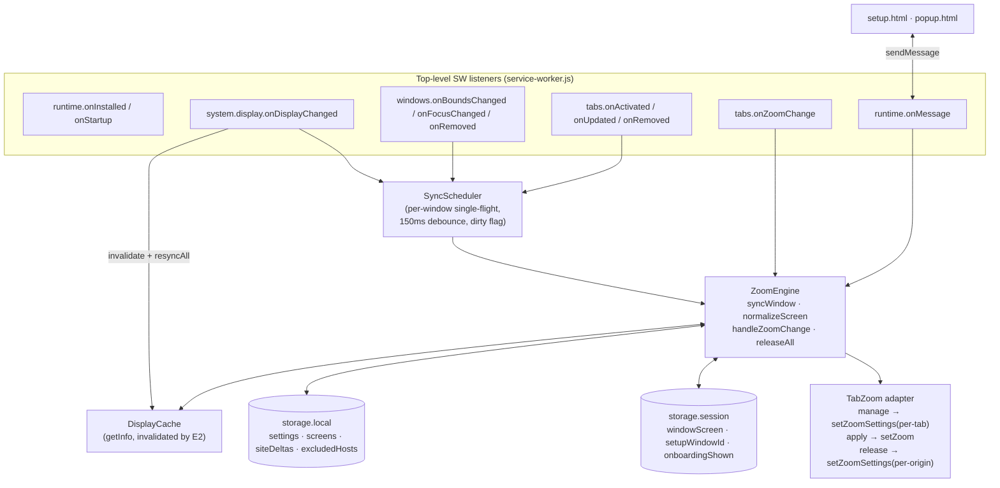

# Engineering Design Document v2: AutoZoom (Manifest V3)

> **Supersedes**: [engineering_doc.md](file:///Users/saritesh/.gemini/jetski/brain/53a911f7-0fe8-453c-9a74-64e9ce2db97c/engineering_doc.md) — see [design_review.md](file:///Users/saritesh/.gemini/jetski/brain/ad50dc32-150d-467d-b875-bb72d5bd2ca2/design_review.md) for why.
> **Reference PRD**: [PRD.md](file:///Users/saritesh/Desktop/ChromeAutoZoom/PRD.md) (with amendments in §9)
> **Standards**: `chrome-extensions` skill, [GEMINI.md](file:///Users/saritesh/Desktop/ChromeAutoZoom/GEMINI.md) (`CHROMEWEBSTORE.md` is created with the first scaffold)

---

## 0. The three decisions that shape everything else

| Decision | Choice | Why |
| :--- | :--- | :--- |
| **Zoom scope** | Every managed tab is switched to `setZoomSettings({ mode: 'automatic', scope: 'per-tab' })` before any `setZoom`. | Chrome's default `per-origin` scope zooms *all* tabs of that origin profile-wide and persists into Chrome's own prefs. That makes per-monitor independence impossible and makes Pause/uninstall irreversible. Per-tab is the only scope that gives one-window-one-zoom. Cost: settings reset on cross-document navigation, so we re-apply in `tabs.onUpdated`. |
| **Manual-zoom detection** | Stateless: ignore `onZoomChange` unless `zoomSettings.scope === 'per-tab'`, then compare `newZoomFactor` to the *expected* zoom for that tab. Mismatch ⇒ user intent. | No TTL lock, no read-modify-write races, no state to lose on SW restart. |
| **Pause / Exclude / Uninstall-safety** | "Releasing" a tab = `setZoomSettings({ scope: 'per-origin' })`, which hands it back to Chrome's native per-origin zoom. | Gives Pause and Exclude real, reversible semantics. Chrome's own zoom memory is never written by AutoZoom. |

---

## 1. Files

Zero-build native ES modules (`"type": "module"` on the SW and `<script type="module">` on pages). Loads unpacked directly; tests run with `node --test` and no dependencies.

```text
ChromeAutoZoom/
├── manifest.json
├── CHROMEWEBSTORE.md                 # Store listing, permission justifications, privacy, version history
├── README.md
├── PRIVACY.md
├── icons/icon-16.png  icon-48.png  icon-128.png
├── src/
│   ├── background/
│   │   ├── service-worker.js         # ONLY top-level listener registration + dispatch (thin)
│   │   ├── sync-scheduler.js         # Per-window single-flight coalescing + debounce
│   │   └── message-router.js         # runtime.onMessage handlers (returns true, async IIFE)
│   ├── lib/
│   │   ├── constants.js              # Ladder, defaults, restricted protocols, timings, badge colours
│   │   ├── zoom-ladder.js            # PURE: step math
│   │   ├── geometry.js               # PURE: window→display resolution (center, intersection, nearest)
│   │   ├── screen-keys.js            # PURE: stable display key generation + matching
│   │   ├── url-rules.js              # PURE: isZoomableUrl, hostOf
│   │   ├── storage.js                # Typed wrappers + schema migration (storage.local / session)
│   │   ├── display-cache.js          # system.display.getInfo with in-memory cache + invalidation
│   │   ├── tab-zoom.js               # Chrome adapter: manage / apply / release a tab, with error handling
│   │   ├── zoom-engine.js            # Orchestration: syncWindow, normalizeScreen, onZoomChange logic
│   │   └── badge.js
│   ├── setup/   setup.html  setup.css  setup.js      # Onboarding (all displays) + new-monitor (one display) modes
│   └── popup/   popup.html  popup.css  popup.js
├── scripts/  generate-icons.py  package-extension.sh
└── tests/
    ├── _chrome-mock.js               # Minimal chrome.* stub for node --test
    ├── zoom-ladder.test.js
    ├── geometry.test.js
    ├── screen-keys.test.js
    ├── url-rules.test.js
    └── zoom-engine.test.js           # Uses the mock; covers manual-detection + navigation-reset cases
```

---

## 2. Manifest

```json
{
  "manifest_version": 3,
  "name": "AutoZoom — Per-Monitor Automatic Zoom",
  "version": "1.0.0",
  "minimum_chrome_version": "102",
  "description": "Automatically switches page zoom between your laptop screen and external monitors. Remembers each display.",
  "permissions": ["system.display", "tabs", "storage"],
  "background": { "service_worker": "src/background/service-worker.js", "type": "module" },
  "action": { "default_popup": "src/popup/popup.html", "default_icon": { "16": "icons/icon-16.png", "48": "icons/icon-48.png", "128": "icons/icon-128.png" } },
  "icons": { "16": "icons/icon-16.png", "48": "icons/icon-48.png", "128": "icons/icon-128.png" }
}
```

> [!NOTE]
> `minimum_chrome_version: 102` because `chrome.storage.session` is required. No `host_permissions`, no `content_scripts`, no `alarms` (the only timer is a sub-second debounce — see §5.3).

---

## 3. Architecture



### Principles

1. **Listeners are registered synchronously at top level**; each handler only calls `scheduler.request(...)` or a single engine function.
2. **No correctness depends on in-memory state.** The two in-memory structures (display cache, scheduler timers) are *caches*: losing them costs one extra API call or one missed debounce, both recovered by the next event.
3. **Every `chrome.tabs.*` / `chrome.windows.*` call is wrapped** in `safeCall()` which swallows the expected churn errors (`No tab with id`, `No window with id`, `Cannot zoom a tab in …`, discarded tab) and logs anything else.
4. **Writes to `storage.local` happen *before* the zoom calls they imply**, so `onZoomChange` always sees the new expected value (required by the stateless detector).

---

## 4. Storage schema (single source, versioned)

```jsonc
// chrome.storage.local
{
  "schemaVersion": 2,
  "enabled": true,
  "onboardingCompleted": false,
  "defaults": { "internal": 1.00, "external": 1.25 },
  "screens": {
    "internal": { "key": "internal", "name": "Built-in Retina Display", "isInternal": true,
                  "zoomFactor": 1.00, "confirmed": true, "lastSeenDisplayId": "69733382" },
    "ext:lg-ultrafine": { "key": "ext:lg-ultrafine", "name": "LG UltraFine", "isInternal": false,
                  "zoomFactor": 1.25, "confirmed": true, "lastSeenDisplayId": "1026386291" }
  },
  "siteStepDeltas": { "news.ycombinator.com": 1 },     // keyed by hostname; 0 ⇒ entry removed
  "excludedHosts":  { "www.figma.com": true }          // record, not array
}

// chrome.storage.session (cleared on browser exit; survives SW restarts)
{
  "windowScreen": { "1234": "ext:lg-ultrafine" },      // last resolved key per windowId
  "setupWindowId": 5678,                                // dedupe: at most one setup window
  "pendingSetupKeys": ["ext:dell-u2723qe"]              // unrecognised displays awaiting a prompt
}
```

**Why hostname, not origin:** Chrome's own zoom memory is per host; the PRD says "domain"; `http://` and `https://` of the same site should share a delta. Path-level rules (`docs.google.com/presentation`) are **out of scope for v1** (PRD amendment §9).

**Migration:** `storage.getState()` reads `schemaVersion`; `migrate(fromVersion)` runs in `onInstalled({reason:'update'})`.

---

## 5. Modules

### 5.1 `zoom-ladder.js` (pure) — unchanged from v1 except:

- `nearestStepIndex(factor)` returns the **nearest** ladder index by absolute difference (always valid, so a pre-install 1.33 maps to step 8/9 deterministically). `ε = 0.005` is used only by `isSameZoom(a, b)`.
- `expectedZoom(screenZoom, delta)` = `factorAtStep(nearestStepIndex(screenZoom) + delta)`.

### 5.2 `screen-keys.js` (pure)

| Function | Behaviour |
| :--- | :--- |
| `buildKey(display, siblings)` | `isInternal` → `"internal"`. Else `"ext:" + slug(name)`. If another *connected* display has the same slug, suffix `"#2"`, `"#3"` by ascending `display.id`. **Resolution is not part of the key** (macOS "Looks like…" scaling changes DIP bounds). |
| `matchSavedScreen(display, screens)` | 1) `lastSeenDisplayId === display.id` → 2) `buildKey` → 3) `isInternal` ↔ saved `isInternal`. Updates `lastSeenDisplayId` on match. |
| `isInternalDisplay(display)` | `display.isInternal \|\| /built-in\|color lcd\|liquid retina/i.test(display.name)` (robustness on older macOS builds). |

### 5.3 `geometry.js` (pure) — `resolveDisplay(win, displays) → { display, confidence }`

1. `win.state === 'minimized'` or missing coords → **return `null`** (caller keeps last known key; never snaps to primary).
2. Display whose `bounds` contains the window center → `confidence: 'center'`.
3. Else largest intersection area > 0 → `'overlap'`.
4. Else **nearest display by center-to-rect distance** → `'nearest'` (window bounds are stale right after an unplug; the delayed re-sync in §6 fixes it).

### 5.4 `display-cache.js`

```js
let cache = null;                       // in-memory; refetched if null (SW restart)
export async function getDisplays() { return cache ??= await chrome.system.display.getInfo(); }
export function invalidate() { cache = null; }
```

### 5.5 `tab-zoom.js` (Chrome adapter — the only module that calls `setZoom`)

| Function | Behaviour |
| :--- | :--- |
| `isManageable(tab)` | `tab.id && tab.url && !tab.discarded && isZoomableUrl(tab.url)` |
| `applyZoom(tabId, target)` | `getZoomSettings` → if `scope !== 'per-tab'` call `setZoomSettings({mode:'automatic', scope:'per-tab'})` → `getZoom` → if `!isSameZoom(cur, target)` `setZoom(tabId, target)`. Returns `'applied' \| 'unchanged' \| 'skipped'`. |
| `releaseZoom(tabId)` | `setZoomSettings({mode:'automatic', scope:'per-origin'})` — tab snaps back to Chrome's own memory for that origin. Used by Pause, Exclude, and `onInstalled`-rollback. |
| `safeCall(fn)` | try/catch wrapper described in §3.3. |

### 5.6 `zoom-engine.js`

| Function | Behaviour |
| :--- | :--- |
| `targetFor(tab, screen, state)` | `null` if `!state.enabled`, `!isManageable`, or `excludedHosts[host]`; else `expectedZoom(screen.zoomFactor, siteStepDeltas[host] ?? 0)`. |
| `syncWindow(windowId, { reason })` | `windows.get(id, {populate:true})` → skip if `type !== 'normal'` → `resolveDisplay` → `null` ⇒ return → `matchSavedScreen` → unconfirmed ⇒ enqueue setup prompt (§7) and use the default anyway → write `windowScreen[windowId]` → `applyZoom` on the **active** tab only (FR-7) → `badge.update(tab)`. |
| `syncTab(tabId)` | Same, for a single tab (used by `onActivated` / `onUpdated`). |
| `normalizeScreen(screenKey)` | All `normal` windows whose resolved key = `screenKey` → every manageable tab, **active tabs first**, through a pool of **8 concurrent** `applyZoom`s. Returns `{ updated, skipped }`. Does **not** block UI responses. |
| `handleZoomChange(info)` | See §5.7. |
| `clearSiteExceptions()` | Wipes `siteStepDeltas`, then `normalizeScreen` for every connected screen. |
| `releaseAll()` | `releaseZoom` on every manageable tab in every normal window (Pause / "Restore Chrome's zoom"). |

### 5.7 Manual-zoom detection (`handleZoomChange`)

```js
export async function handleZoomChange({ tabId, newZoomFactor, zoomSettings }) {
  if (zoomSettings.scope !== 'per-tab') return;          // (1) not ours / just navigated → ignore
  const state = await getState();
  if (!state.enabled) return;
  const tab = await safeCall(() => chrome.tabs.get(tabId)); if (!tab || !isManageable(tab)) return;
  const host = hostOf(tab.url); if (state.excludedHosts[host]) return;
  const screen = await screenForWindow(tab.windowId);  if (!screen) return;
  const expected = expectedZoom(screen.zoomFactor, state.siteStepDeltas[host] ?? 0);
  if (isSameZoom(newZoomFactor, expected)) return;        // (2) matches what we'd set → no-op
  const delta = nearestStepIndex(newZoomFactor) - nearestStepIndex(screen.zoomFactor);
  await setSiteStepDelta(host, delta);                    // 0 ⇒ removes the entry
  await badge.update(tab);
}
```

Why this is correct: AutoZoom always writes storage *before* zooming, so any event caused by AutoZoom lands exactly on `expected`. Any event that doesn't is either a user keystroke or another extension — both deserve to be honored. Per-tab scope guarantees sibling tabs never receive our events.

### 5.8 `badge.js`

`setBadgeText({ tabId, text })` (tab-scoped, so re-applied on every `syncTab`). Text: `"OFF"` grey · `"PIN"` amber · `"125"` blue (3 chars, no `%`) · `""` when at 100% with no delta. `setTitle` carries the full sentence ("LG UltraFine · 125% · +1 step for news.ycombinator.com").

---

## 6. Event handling (`service-worker.js` → `sync-scheduler.js`)

| Event | Handler |
| :--- | :--- |
| `runtime.onInstalled` `install` | `initState()` → `syncDisplays()` → if `!onboardingCompleted` open setup in **onboarding mode** (§7). Do **not** zoom anything until the user confirms. |
| `runtime.onInstalled` `update` | `migrate()` → `syncDisplays()` → `resyncAllWindows()`. |
| `runtime.onStartup` | `syncDisplays()` → `resyncAllWindows()` (session storage is empty after browser restart). |
| `system.display.onDisplayChanged` | `displayCache.invalidate()` → **debounce 500 ms** → `syncDisplays()` (creates profiles, queues unrecognised externals for a prompt) → `resyncAllWindows()` → **schedule one more `resyncAllWindows()` at +1500 ms** (macOS relocates windows after the event). |
| `windows.onBoundsChanged` | `scheduler.request(windowId, 'bounds')` — debounced 150 ms per window; only runs `syncWindow` if the resolved key differs from `windowScreen[windowId]`. |
| `windows.onFocusChanged` | Ignore `WINDOW_ID_NONE`; `scheduler.request(windowId, 'focus')` (not debounced; coalesced). |
| `windows.onRemoved` / `tabs.onRemoved` | Delete `windowScreen[windowId]`; if it was `setupWindowId`, clear it. |
| `tabs.onActivated` | `syncTab(tabId)` (FR-8 lazy). |
| `tabs.onUpdated` | If `changeInfo.url` (committed navigation — this is when per-tab settings were reset) **or** `changeInfo.status === 'complete'` → `syncTab(tabId)`. Also handles tabs un-discarding. |
| `tabs.onZoomChange` | `handleZoomChange(info)`. |

### `sync-scheduler.js`

```js
const inflight = new Map();   // windowId → { running: Promise, dirty: boolean }
const timers   = new Map();   // windowId → timeoutId (150 ms debounce for 'bounds')
export function request(windowId, reason) { /* debounce bounds; else run() */ }
async function run(windowId) {
  const slot = inflight.get(windowId);
  if (slot) { slot.dirty = true; return; }               // one trailing re-run max
  const s = { dirty: false }; inflight.set(windowId, s);
  try { await syncWindow(windowId); } finally { inflight.delete(windowId); }
  if (s.dirty) run(windowId);
}
```

> [!NOTE]
> `setTimeout` is used deliberately. `chrome.alarms` has a 30 s minimum. The SW is guaranteed alive during the event burst that created the timer; if it were ever killed mid-debounce the next `onFocusChanged`/`onActivated` restores correctness.

---

## 7. Setup window (`setup.html`) — two modes, one window at a time

| Mode | Trigger | Content |
| :--- | :--- | :--- |
| `?mode=onboarding` | First install | One row **per connected display** (name, Built-in/External pill, zoom selector pre-filled 100%/125%) **plus** a row for whichever class is absent ("External monitors you plug in later: 125%" on MacBook-only; "Built-in display: 100%" in clamshell). One **Apply** button. Covers PRD Cases A, B, C with a single window and a single storage write. |
| `?mode=new-display&key=…` | `syncDisplays` finds an unrecognised external monitor after onboarding | Compact single-display card, pre-filled from `defaults.external`, opened centered on *that* display's bounds. |

Rules:
- `setupWindowId` in `storage.session` guarantees **at most one** setup window; a second request appends to `pendingSetupKeys` and the open window re-renders.
- Window is `type:'popup'`, `width 420`, `height = 180 + 64·rows`, `focused:true`; the SW ignores its own setup window in all handlers (`type !== 'normal'`).
- `CONFIRM` message: SW writes `screens[*].zoomFactor/confirmed` and `onboardingCompleted = true`, **responds immediately**, then runs `normalizeScreen` for each confirmed key in the background. `setup.js` calls `window.close()` on the response.
- Query params are `encodeURIComponent`-ed.

---

## 8. Popup (`popup.html`)

Unchanged in layout from v1 (header toggle · Current Screen card · Current Site · Saved Screens accordion · footer), with these semantic fixes:

| Control | Message | SW behaviour |
| :--- | :--- | :--- |
| Global toggle **off** | `SET_ENABLED false` | `enabled=false` → `releaseAll()` (tabs return to Chrome's zoom) → badge `OFF` |
| Global toggle **on** | `SET_ENABLED true` | `enabled=true` → `resyncAllWindows()` |
| Screen zoom pill / ± | `SET_SCREEN_ZOOM {key, factor}` | write → `normalizeScreen(key)` |
| Exclude site | `SET_EXCLUDED {host, excluded}` | write → `releaseZoom` on all tabs of that host (excluded) / `syncTab` (un-excluded) |
| Reset site | `CLEAR_SITE_DELTA {host}` | delete → `syncTab` on all tabs of that host |
| Footer **"Clear all site exceptions"** | `CLEAR_SITE_EXCEPTIONS` | `clearSiteExceptions()` |
| Footer **"Restore Chrome's zoom"** (secondary, confirm dialog) | `RELEASE_ALL` | `releaseAll()` + `enabled=false` |

All `onMessage` handlers use the async-IIFE + `return true` pattern. Popup subscribes to `chrome.storage.onChanged` for live updates.

---

## 9. PRD amendments required

| PRD item | Change |
| :--- | :--- |
| FR-3 (3) "fall back to primary if minimized" | → "skip sync for minimized windows; keep last known screen" |
| Journey 1 Case A "a popup per external monitor" | → "one onboarding window listing all displays" |
| Journey 6 "Reset All to 100%" | → split into "Clear all site exceptions" and "Restore Chrome's zoom" |
| Journey 5 `docs.google.com/presentation` | → host-level exclusions only in v1 |
| FR-10 "track in-flight setZoom calls in memory" | → stateless scope-guard + expected-value comparison (§5.7) |
| §6.2 storage schema | → replaced by §4 |
| New FR-13 (Reversibility) | "AutoZoom never writes Chrome's per-origin zoom memory; Pause/Exclude/uninstall restore native zoom." |
| New non-goal | Honoring `Cmd+0` specially (recorded as a normal delta) — pending decision |

---

## 10. Testing

- `node --test tests/` — zero dependencies.
- Pure modules (`zoom-ladder`, `geometry`, `screen-keys`, `url-rules`) tested directly.
- `zoom-engine.test.js` uses `_chrome-mock.js` (in-memory `tabs`, `windows`, `storage`, `system.display`) and must cover:
  1. Same origin in two windows on two screens → each tab keeps its own zoom (regression for v1's C1).
  2. `onZoomChange` with `scope:'per-origin'` after navigation → no delta written.
  3. `onZoomChange` equal to expected → no delta; `+1 step` → delta `1`; back → entry removed.
  4. Minimized window → no `setZoom`.
  5. Unplug with stale bounds → `'nearest'` resolution, then corrected on delayed re-sync.
  6. 150 tabs, 40 discarded → exactly 110 `applyZoom` calls, ≤ 8 concurrent.
  7. Pause → every managed tab receives `scope:'per-origin'`.
- Manual QA matrix (macOS): MacBook-only · MacBook + 1 ext · clamshell · 2 identical monitors · change macOS scaling · Chrome restart · extension update.

---

## 11. Chrome Web Store (`CHROMEWEBSTORE.md`)

v1's §4 is retained verbatim with these additions:

- **Install warning note** in the listing: *"Chrome shows 'Read your browsing history' because AutoZoom needs to know each tab's website to apply per-site zoom. AutoZoom never reads page content and never sends data anywhere."*
- **Reversibility** in the description: *"Pause or uninstall at any time — your original Chrome zoom settings are untouched."* (Now true because of §0.)
- `minimum_chrome_version` listed; packaging script unchanged.
