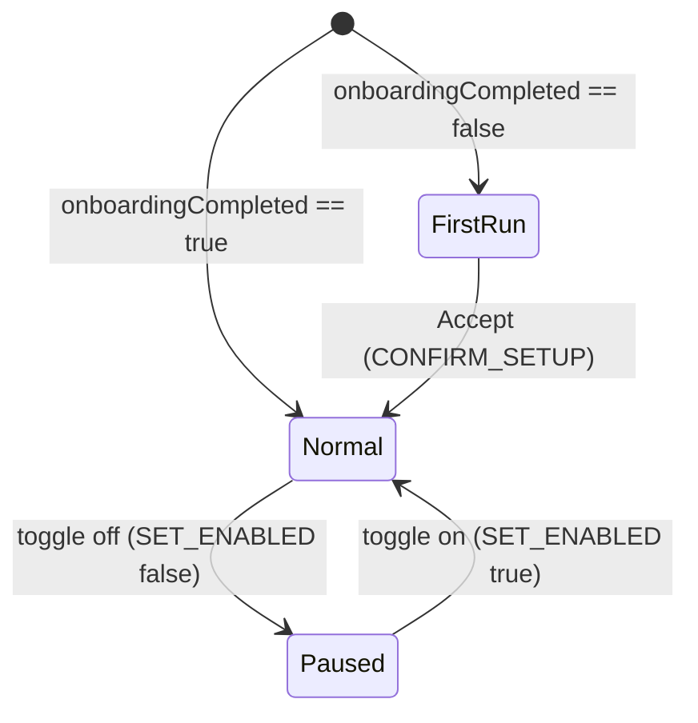

# Engineering Design Document v3: AutoZoom (Manifest V3)

> **Supersedes** [engineering_doc_v2.md](file:///Users/saritesh/.gemini/jetski/brain/ad50dc32-150d-467d-b875-bb72d5bd2ca2/engineering_doc_v2.md) for the sections listed in §0. Everything not mentioned here is **unchanged from v2** (zoom scope, stateless detector, scheduler, geometry, display cache, tab-zoom adapter, storage serialisation).
> **Decision source**: [change_proposals_review.md](file:///Users/saritesh/.gemini/jetski/brain/ad50dc32-150d-467d-b875-bb72d5bd2ca2/change_proposals_review.md) (rev 2 + inline comments).
> **Target version**: `1.1.0`, `minimum_chrome_version: "127"`.

---

## 0. What changes, in one table

| # | Area | v2 (shipped 1.0.0) | v3 |
|---|---|---|---|
| 1 | Screen defaults | Two seeds `defaults{internal, external}` | **Resolution → zoom map** (`zoom-map.js`) + user-taught overrides `learnedDefaults` |
| 1 | New screen after first run | Setup window prompt, nothing applied until confirmed | **Apply map value to every tab on that screen immediately.** No prompt, no badge. Adjust later from the popup. |
| 1 | Install | Setup window (`src/setup/`) | **Toolbar popup first-run state**, opened with `chrome.action.openPopup()`. Nothing applied until **Accept**. If `openPopup` fails → wait for the user to click the icon. |
| 1 | `!` badge / tab counts | — | **Out of scope.** Badge stays as today (`125` / `OFF` / `PIN`). |
| 2 | Site deltas | `siteStepDeltas{host: int}` (global) | `siteStepDeltas{host: {screenKey: {delta, updatedAt}}}`; **inherit** from the closest-resolution screen, then most recent; first Cmd± on a screen writes an explicit row (0 included) |
| 2 | Reset site | `CLEAR_SITE_DELTA` + button | **Removed.** Exclude clears all rows for the host. Clear-all wipes everything. |
| 3 | Screen card | One line "External Display · 2560×1440" (clips) | **Two lines**: editable name / `2560×1440 · 125% recommended`. New `RENAME_SCREEN`. |
| 4 | Turn Off | `enabled=false` → `releaseAll()` | **Freeze & detach**: `enabled=false`, tabs untouched. "Restore Chrome's zoom" is the only release. |
| — | Removed | `src/setup/*`, `setup-window.js`, `SETUP_MODE`, `SETUP_WINDOW`, session `setupWindowId`/`pendingSetupKeys`, `GET_SETUP_DATA`, `DISMISS_SETUP`, `OPEN_ONBOARDING`, `CLEAR_SITE_DELTA`, `screens[*].confirmed`, `defaults` | |

> [!NOTE]
> **Decision 1.2 ("skip if all tabs already at the map value") is satisfied by construction.** With 1.3 (apply immediately, no prompt) the only thing a skip could avoid is a `setZoom` to a tab already at the target — and `applyZoom` already returns `'unchanged'` without calling `setZoom` in that case. No separate uniformity scan is needed, so none is built.

---

## 1. Files

```text
src/
├── background/
│   ├── service-worker.js        # install → openPopup; display change → normalize new screens
│   ├── sync-scheduler.js        # unchanged
│   └── message-router.js        # message table §8 (4 removed, 1 added)
├── lib/
│   ├── constants.js             # SCHEMA_VERSION 3, RECOMMENDED_ZOOM table, MSG diff, remove SETUP_*
│   ├── zoom-map.js              # NEW, pure: sizeKey(), recommendedZoom(display|screen, learned)
│   ├── site-deltas.js           # NEW, pure: resolveDelta(), setDelta(), pruneHost(), clearHost()
│   ├── screen-keys.js           # defaultScreenName(), profile gains width/height; confirmed removed
│   ├── storage.js               # schema v3 + migrate v2→v3; session: windowScreen only
│   ├── zoom-engine.js           # targetFor/handleZoomChange use resolveDelta; setEnabled no longer releases
│   ├── badge.js                 # title shows inherited source; no other change
│   ├── tab-zoom.js  geometry.js  display-cache.js  url-rules.js  zoom-ladder.js   # unchanged
│   └── setup-window.js          # DELETED
├── setup/                       # DELETED
└── popup/  popup.html  popup.css  popup.js   # first-run state, two-line card, rename, inherited label
tests/
├── zoom-map.test.js  site-deltas.test.js     # NEW
├── setup-window.test.js                      # DELETED (if present) — scenarios move to message-router/service-worker
└── (others updated — see §10)
```

---

## 2. Manifest

```diff
-  "version": "1.0.0",
-  "minimum_chrome_version": "102",
+  "version": "1.1.0",
+  "minimum_chrome_version": "127",
```

Permissions unchanged (`system.display`, `tabs`, `storage`). `127` is required for `chrome.action.openPopup()` outside policy installs. Side benefit: D13's `light-dark()` restriction is lifted (optional cleanup, not required).

---

## 3. Storage schema v3

```jsonc
// chrome.storage.local
{
  "schemaVersion": 3,
  "enabled": true,
  "onboardingCompleted": false,          // = first-run Accept pressed. Gate for ALL zooming.
  "learnedDefaults": {                   // user-taught map overrides, externals only
    "2560x1440": 1.10
  },
  "screens": {
    "internal": {
      "key": "internal", "name": "MacBook Screen", "isInternal": true,
      "width": 1728, "height": 1117,     // logical (DIP) size, refreshed on every match
      "zoomFactor": 1.00, "lastSeenDisplayId": "1", "createdAt": 1790960000000
    },
    "ext:2560x1440": {
      "key": "ext:2560x1440", "name": "External Display", "isInternal": false,
      "width": 2560, "height": 1440,
      "zoomFactor": 1.25, "lastSeenDisplayId": "2", "createdAt": 1790960001000
    }
  },
  "siteStepDeltas": {
    "mail.google.com": {
      "ext:2560x1440": { "delta": 1, "updatedAt": 1790961000000 },
      "internal":      { "delta": 0, "updatedAt": 1790961500000 }   // explicit 0 = "do not inherit"
    }
  },
  "excludedHosts": { "www.figma.com": true }
}

// chrome.storage.session
{ "windowScreen": { "1234": "ext:2560x1440" } }
```

**Removed:** `defaults`, `screens[*].confirmed`, session `setupWindowId`, `pendingSetupKeys`.

### Migration v2 → v3 (`storage.migrateFrom`, runs in `onInstalled{reason:'update'}`)

| v2 | v3 |
|---|---|
| `defaults` | dropped (`learnedDefaults = {}`) |
| `screens[k].confirmed` | dropped |
| `screens[k].name` equal to the v2 auto-label (`"Built-in Display"`, `"External Display"`, `"External Display · WxH"`) | replaced by `defaultScreenName()` (§5.2); user-looking names kept verbatim |
| `screens[k].width/height` | `null` until the display is next seen (`resolveDelta` treats `null` area as "unknown", see §5.3) |
| `siteStepDeltas[host] = n` | `{ [k]: { delta: n, updatedAt: now } }` for **every** existing screen key `k` — reproduces v2 behaviour exactly until the user adjusts per screen |
| session keys | `setupWindowId`, `pendingSetupKeys` removed |

---

## 4. Recommended-zoom map (`zoom-map.js`, pure)

```js
// constants.js
export const RECOMMENDED_ZOOM = Object.freeze({
  internal: 1.0,
  bySize: Object.freeze({            // logical WxH → factor
    '2560x1080': 1.10,
    '3840x2160': 1.50,
    '5120x2880': 2.00,
  }),
  smallExternalMax: { width: 1920, height: 1200 },  // ≤ this → 1.0
  externalFallback: 1.25,
});

// zoom-map.js
export const sizeKey = ({ width, height }) => `${Math.round(width)}x${Math.round(height)}`;

export function recommendedZoom({ isInternal, width, height }, learned = {}) {
  if (isInternal) return RECOMMENDED_ZOOM.internal;
  const k = sizeKey({ width, height });
  if (learned[k]) return learned[k];
  if (RECOMMENDED_ZOOM.bySize[k]) return RECOMMENDED_ZOOM.bySize[k];
  if (width <= 1920 && height <= 1200) return 1.0;
  return RECOMMENDED_ZOOM.externalFallback;      // 2560×1440, 2560×1600, 3008×1692, 3440×1440, 3840×1600, 5120×1440, …
}
```

Deliberately simple (your call): exact-size table + one "small monitor" rule + fallback. No `dpiX/dpiY`, no PPI math at runtime. The table in the review doc is the rationale, not the code.

**Learning:** `SET_SCREEN_ZOOM` on an external screen writes `learnedDefaults[sizeKey(screen)] = factor`. The next never-seen monitor with the same logical size seeds from it. Existing screens are not touched (each has its own `zoomFactor`). Internal is never learned (always 1.0 by map; the user can still change the internal screen's own `zoomFactor`).

---

## 5. Module changes

### 5.1 `screen-keys.js`

| Function | Change |
|---|---|
| `newScreenProfile(display, key, zoomFactor, existingScreens)` | Adds `width`, `height` (from `display.bounds`), `createdAt: Date.now()`, `name: defaultScreenName(display, key, existingScreens)`. Drops `confirmed`. |
| `defaultScreenName(display, key, screens)` **new** | Internal → `"MacBook Screen"`. External → `"External Display"`, or `"External Display N"` where `N` = 1 + count of existing external profiles (so a second monitor becomes "External Display 2"). The macOS display name, when non-empty, is still preferred: `display.name` → used as-is. |
| `displayLabel` | Kept only for the subtitle's resolution text; no longer the profile name. |
| `matchSavedScreen` | Unchanged. Caller additionally refreshes `width/height` when they differ from `display.bounds` (macOS "Looks like…" change). |

### 5.2 `site-deltas.js` (new, pure)

```js
/** Explicit row, else inherited from the closest screen, else 0. */
export function resolveDelta(host, screenKey, state) {
  const rows = state.siteStepDeltas?.[host];
  if (!rows) return { delta: 0, source: null, inherited: false };
  if (rows[screenKey]) return { delta: rows[screenKey].delta, source: screenKey, inherited: false };

  const me = state.screens[screenKey];
  const candidates = Object.entries(rows)
    .filter(([k]) => k !== screenKey && state.screens[k])
    .map(([k, row]) => ({ key: k, row, screen: state.screens[k] }));
  if (!candidates.length) return { delta: 0, source: null, inherited: false };

  const sameClass = candidates.filter((c) => Boolean(c.screen.isInternal) === Boolean(me?.isInternal));
  const pool = sameClass.length ? sameClass : candidates;
  pool.sort((a, b) => areaGap(me, a.screen) - areaGap(me, b.screen) || b.row.updatedAt - a.row.updatedAt);
  return { delta: pool[0].row.delta, source: pool[0].key, inherited: true };
}

// |Δ area| in logical px²; unknown sizes sort last (Infinity) so recency decides among them
function areaGap(a, b) {
  const area = (s) => (s?.width && s?.height ? s.width * s.height : null);
  const x = area(a), y = area(b);
  return x == null || y == null ? Number.POSITIVE_INFINITY : Math.abs(x - y);
}

/** Returns the next siteStepDeltas record with an explicit row written (0 allowed). */
export function withDelta(siteStepDeltas, host, screenKey, delta, now = Date.now()) {
  const rows = { ...(siteStepDeltas[host] ?? {}), [screenKey]: { delta: delta | 0, updatedAt: now } };
  const next = { ...siteStepDeltas, [host]: rows };
  return pruneHost(next, host);   // every row 0 ⇒ host removed entirely
}

export function withoutHost(siteStepDeltas, host) { /* delete key, return copy */ }
```

Rules captured: your inheritance order (same class → smallest |Δ area| → most recent); explicit 0 rows block inheritance; a host whose rows are **all** 0 is pruned (so "Clear all" counts stay meaningful).

### 5.3 `storage.js`

| Function | Change |
|---|---|
| `defaultState()` / `normalize()` | `learnedDefaults: {}`; `siteStepDeltas` values validated as `{screenKey: {delta:int, updatedAt:num}}` (anything else dropped). |
| `setSiteStepDelta(host, screenKey, delta)` | Signature gains `screenKey`; uses `withDelta` inside `updateState`. **0 is persisted** (not removed). |
| `clearHostDeltas(host)` **new** | `withoutHost`. Called by `setExcluded(host, true)`. |
| `setLearnedDefault(sizeKey, factor)` **new** | |
| `renameScreen(key, name)` **new** | Trim, collapse whitespace, max 40 chars; empty ⇒ revert to `defaultScreenName`. |
| `getSession()` and friends | Only `windowScreen` remains; `setSetupWindowId`, `addPendingSetupKey`, `clearPendingSetupKeys` deleted. |
| `migrate()` | v2→v3 per §3. v1→v3 goes through the v2 shape first (existing code) then v3. |

### 5.4 `zoom-engine.js`

| Function | Change |
|---|---|
| `targetFor(tab, screen, state)` | Gate unchanged (`enabled`, `onboardingCompleted`, manageable, not excluded). Delta now `resolveDelta(host, screen.key, state).delta`. |
| `syncDisplays()` | New profiles seeded with `recommendedZoom(display, state.learnedDefaults)`. **After first run**, every created key is returned in `created` and the caller normalizes it (see §6) — this *is* decision 1.3. No prompt queue. |
| `resolveScreenForWindow()` | Same seeding; when it creates a profile post-first-run it fires `normalizeScreen(key)` in the background (not awaited) so a window dragged to a never-seen monitor gets all its tabs set, not only the active one. Also refreshes `width/height` on match. |
| `syncWindow()` | Remove the `requestNewDisplayPrompt` branch. |
| `handleZoomChange()` | `expected = expectedZoom(screen.zoomFactor, resolveDelta(...).delta)`; on mismatch `storage.setSiteStepDelta(host, screen.key, stepDelta(new, screen.zoomFactor))` — writes an explicit per-screen row even when the result is 0 (that is what makes "correct it back on the internal screen" stick). |
| `setEnabled(false)` | **Only** `patchState({enabled:false})` + badge `OFF` on active tabs. No `releaseAll()`. Tabs stay in per-tab scope at their current zoom; Chrome itself resets them to per-origin on their next cross-document navigation — exactly "freeze & detach". |
| `setEnabled(true)` | Unchanged: `resyncAllWindows('resume')` + `normalizeScreen` for every connected key (so background tabs re-sync too, matching your "immediately, every tab" answer). |
| `releaseAll()` | Unchanged; now reachable only via `RELEASE_ALL` ("Restore Chrome's zoom"), which still also sets `enabled=false`. |
| `setScreenZoom(key, factor)` | Also `setLearnedDefault(sizeKey(screen), factor)` when `!screen.isInternal`. |
| `setExcluded(host, true)` | Also `clearHostDeltas(host)`. |
| `clearSiteDelta()` | **Deleted.** |
| `confirmSetup({screens})` | Writes `zoomFactor` per key + `onboardingCompleted=true`; for external keys whose chosen value ≠ map value, also `setLearnedDefault`. No `closeSetupWindow`. |
| `renameScreen(key, name)` **new** | storage write, then badge title refresh on active tabs of that screen. |

### 5.5 `badge.js`

Only the hover title changes: `AutoZoom · External Display · 150% · +1 step for mail.google.com (inherited from MacBook Screen)`. Text/colour rules unchanged; no `!` state.

---

## 6. Event handling diff (`service-worker.js`)

| Event | v3 handler |
|---|---|
| `runtime.onInstalled` `install` | `initState()` → `syncDisplays()` → `safeCall(() => chrome.action.openPopup())`. Failure (older Chrome, no focused normal window, user mid-gesture) is logged and **ignored**: the first-run state simply appears on the next icon click. Nothing is zoomed until Accept. |
| `runtime.onInstalled` `update` | `migrate()` → `syncDisplays()` → `resyncAllWindows()`. If `onboardingCompleted` is still `false` after migration (user never finished v2 setup) → `openPopup()` as for install. |
| `runtime.onStartup` | Unchanged. |
| `system.display.onDisplayChanged` (debounced 500 ms) | `syncDisplays()` → `resyncAllWindows('display')` → **`normalizeScreen(k)` for every `k` in `created`** → delayed pass at +1500 ms: `resyncAllWindows('display-delayed')` and **again `normalizeScreen(k)` for the same created keys** (macOS moves windows onto the new monitor after the first pass). Created keys live in a module-level `Set` between the two passes (cache semantics: a lost SW just means background tabs sync lazily on activation, FR-8). |
| `windows.onRemoved` | `scheduler.forget` + `deleteWindowScreen`. No setup-window bookkeeping. |
| everything else | Unchanged. |

---

## 7. Popup (`popup.html` / `popup.js`) — the only UI surface

### 7.1 States



**First-run state** (replaces the setup window and the "Setup not finished" banner):

```
┌──────────────────────────────────────────────┐
│ ◎ AutoZoom                                   │
│                                              │
│ Welcome. AutoZoom gives every screen its own │
│ default page zoom. Here's what we recommend: │
│                                              │
│  MacBook Screen            [100% ▾]          │
│  1728×1117                                   │
│  External Display          [125% ▾]          │
│  2560×1440 · recommended                     │
│                                              │
│  [        Accept and start        ]          │
│                                              │
│  Tip: click the puzzle icon ⧉ in the toolbar │
│  and pin AutoZoom so it's always one click   │
│  away.                                       │
└──────────────────────────────────────────────┘
```

- One row per **connected** display (`GET_POPUP_STATE.firstRun.rows`), selects pre-filled from `recommendedZoom`. No "monitors you plug in later" row — the map covers that now.
- Accept → `CONFIRM_SETUP { screens: { key: factor } }` → SW responds immediately and normalizes all keys in the background → popup re-renders to Normal.
- Closing the popup without Accept changes nothing; the same state shows on the next click.

**Normal state** — as today, with:

- **Current Screen card, two lines** (fixes the clipping):
  ```
  CURRENT SCREEN                         [Built-in]
  External Display              ✎   [−] 125% [+]
  2560×1440 · 125% recommended
  [100%] [110%] [125%] [150%]
  ```
  Line 1 is the editable name (`✎` → inline `<input maxlength=40>`, Enter/blur → `RENAME_SCREEN`, Esc cancels). Line 2 = `W×H · N% recommended` (N from `recommendedZoom` with learned overrides); when the current value equals N the suffix reads just `· recommended`. Name is `text-overflow: ellipsis` on its own line, so it can no longer collide with the stepper.
- **Current Site card:** `Reset` button removed. Subtitle variants:
  `Uses screen default (125%)` · `+1 step on this screen → 150%` · `+1 step · inherited from MacBook Screen → 150%`.
- **Header toggle off:** label `Paused`. No further wording. Toggle on: `On`.
- **Saved screens accordion:** each row two-line as well (name / `W×H`), plus the mini select; names editable there too (same `RENAME_SCREEN`).
- **Footer:** `Clear all site exceptions` (unchanged) · `Restore Chrome's zoom` (unchanged; dialog text updated to say this is the only action that hands tabs back to Chrome).

---

## 8. Message table (`message-router.js`)

| Message | Payload | SW behaviour | Status |
|---|---|---|---|
| `GET_POPUP_STATE` | `{tabId, windowId}` | Returns `enabled, onboardingCompleted, ladder, screen{…, width, height, recommended}`, `site{host, delta, inherited, source, sourceName, expected, excluded}`, `screens[]` (each with `recommended`), `firstRun{rows[]}` when not accepted, `exceptionCount` (= number of hosts with rows), `excludedCount` | changed |
| `CONFIRM_SETUP` | `{screens:{key:factor}}` | `engine.confirmSetup` → respond → background `normalizeScreen` for each key + `resyncAllWindows` | payload simplified (no `defaults`, no `__external_default__`) |
| `SET_ENABLED` | `{enabled}` | `engine.setEnabled` (freeze on false) | semantics changed |
| `SET_SCREEN_ZOOM` | `{key, factor}` | write + learn + background normalize | + learn |
| `RENAME_SCREEN` | `{key, name}` | `engine.renameScreen` | **new** |
| `SET_EXCLUDED` | `{host, excluded}` | write (+ clear host deltas when excluding) → release / re-sync tabs of host | + clear deltas |
| `CLEAR_SITE_EXCEPTIONS` | — | wipe `siteStepDeltas` → normalize every connected screen | unchanged |
| `RELEASE_ALL` | — | `releaseAll()` + `enabled=false` | unchanged |
| `GET_SETUP_DATA`, `DISMISS_SETUP`, `OPEN_ONBOARDING`, `CLEAR_SITE_DELTA` | | | **removed** |

---

## 9. PRD / DEVIATIONS amendments

| Document | Change |
|---|---|
| `PRD.md` Journey 1 (install) | "one onboarding window listing all displays" → "the toolbar popup opens in a first-run state listing connected displays; Accept applies them". |
| `PRD.md` Journey 2 (new monitor) | "compact prompt" → "recommended zoom applied immediately; adjust in popup". |
| `PRD.md` FR-4 / defaults | `defaults{internal, external}` → resolution map + learned overrides (§4). |
| `PRD.md` FR-11 (site deltas) | deltas are per (site, screen) with inheritance rule §5.2; 125% + 1 step = 150%. |
| `PRD.md` FR-13 (Reversibility) | Pause clause rewritten: "Turning AutoZoom off freezes tabs at their current zoom and stops intervening; *Restore Chrome's zoom* is the explicit release. AutoZoom still never writes Chrome's per-origin memory." |
| `PRD.md` §schema | replace with §3. |
| `PRD.md` Journey 6 | drop "Reset site". |
| `DEVIATIONS.md` | D3 (nothing zoomed before confirm — still true, confirm is now the popup), D6/D14/D16 (setup window) → marked **obsolete in 1.1.0**; D13 note that `light-dark()` is now allowed; new D21 "Pause freezes instead of releasing", D22 "explicit 0 delta rows", D23 "openPopup failure is silent". |

---

## 10. Tests (`node --test tests/`)

New / changed scenarios (keep all existing ones that still apply):

| File | Scenario |
|---|---|
| `zoom-map.test.js` | internal → 1.0 regardless of size · 1920×1080 → 1.0 · 2560×1440 → 1.25 · 2560×1080 → 1.1 · 3840×2160 → 1.5 · 5120×2880 → 2.0 · unknown 3440×1440 → 1.25 · learned override wins over table · learned never applies to internal |
| `site-deltas.test.js` | explicit row wins · inherit same class before other class · smaller |Δ area| wins over recency · equal area → most recent wins · unknown sizes fall back to recency · explicit 0 blocks inheritance · host with all-0 rows is pruned · `withoutHost` |
| `storage.test.js` | v2→v3 migration: global delta fans out to every screen key; `confirmed`/`defaults` dropped; auto-names rewritten, custom names preserved; session keys removed · `renameScreen` trims / caps / reverts on empty |
| `zoom-engine.test.js` | Gmail +1 on external → internal tab renders +1 (inherited) → Cmd− on internal writes `{internal: 0}` → external still +1, internal 0 · Turn Off: zero `setZoomSettings`/`setZoom` calls, tabs keep zoom · Resume: every tab on every screen re-applied · `SET_SCREEN_ZOOM` on external writes `learnedDefaults`; on internal does not · new external after first run → every manageable tab on it gets `applyZoom` with the map value without any message · never-seen monitor via window drag → `normalizeScreen` fired · exclude host → its delta rows gone |
| `message-router.test.js` | `GET_POPUP_STATE.firstRun.rows` lists connected displays with map values · `CONFIRM_SETUP` sets `onboardingCompleted` and seeds learned defaults for changed externals · `RENAME_SCREEN` · removed messages return `Unknown message type` |
| `service-worker.test.js` | install → `chrome.action.openPopup` called once; rejection swallowed · display change → `normalizeScreen` called for created keys in both passes · update with `onboardingCompleted=false` → `openPopup` |

Mock additions: `chrome.action.openPopup` (resolve / reject switch), `display.bounds` sizes on fixtures, `Date.now` injection for `updatedAt` ordering.

**Manual QA (live Chrome, this Mac):** fresh install → popup opens on the external display's window → Accept → both screens zoomed · unplug/replug external → no prompt, tabs at 125% · Gmail +1 external / −1 internal scenario · toggle off → Cmd+ a tab → navigate it → it follows Chrome's zoom · rename external → badge title and card update · two-line card not clipped at 340 px.

---

## 11. Chrome Web Store (`CHROMEWEBSTORE.md`)

- Version history: **1.1.0** — "Setup now happens in the toolbar popup; new monitors get a recommended zoom automatically; per-screen site adjustments; renameable screens; Pause keeps your current zoom."
- Description tweak: "Pause at any time — your tabs keep the zoom they have. Use *Restore Chrome's zoom* to hand everything back to Chrome."
- `minimum_chrome_version` → 127 noted in Compatibility.
- No permission changes → no new justifications. Screenshot: retake the popup (two-line card).

---

## 12. Implementation order

1. `constants.js`, `zoom-map.js`, `site-deltas.js` + their tests (pure, no Chrome).
2. `storage.js` schema v3 + migration + tests.
3. `screen-keys.js` profile shape; `zoom-engine.js` changes; delete `setup-window.js`, `src/setup/`; `service-worker.js` events.
4. `message-router.js` table; `popup.*` first-run state, two-line card, rename, inherited label, Paused wording.
5. Manifest 1.1.0 / 127; `PRD.md`, `DEVIATIONS.md`, `README.md`, `CHROMEWEBSTORE.md`, `PRIVACY.md` (no change expected).
6. `node --test tests/`, `scripts/static-scan.mjs`, `sh scripts/package-extension.sh`, live QA from `dist/unpacked/`.

> [!IMPORTANT]
> Before step 6's live QA the extension must be reinstalled fresh (or the v2 → v3 update path exercised deliberately) — both paths are in scope.
